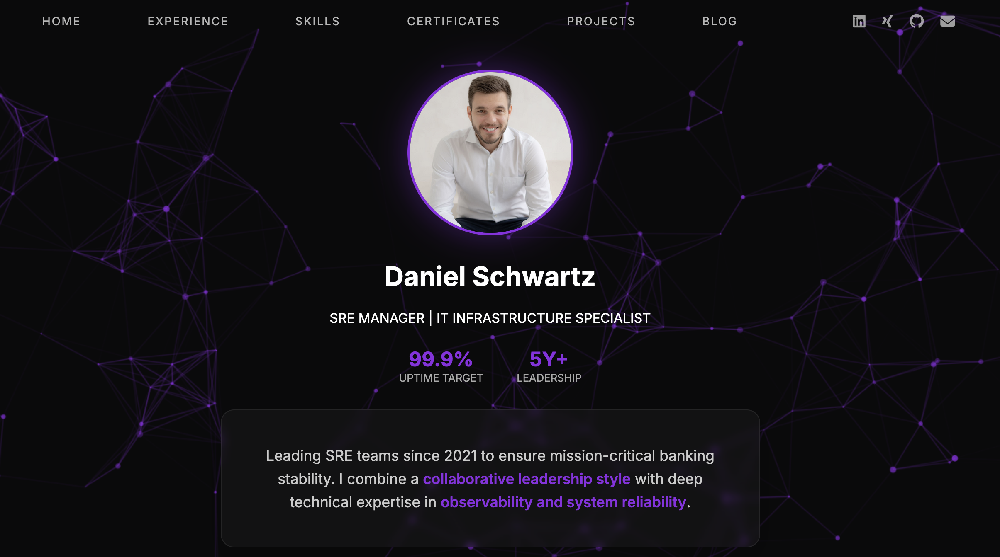

# Personal Website Template

This repository contains both the source code for my personal website https://schwartzdaniel.com and the **GitOps-driven infrastructure** (Kubernetes/Helm) that powers the entire project.

## Demo

---

## Tech Stack

The stack is built with a focus on **automation and SRE best practices**:

* **Infrastructure:** Linux VPS (Rocky Linux release 9.1)
* **Orchestration:** [k3s](https://k3s.io/) (Lightweight Kubernetes).
* **GitOps:** [ArgoCD](https://argoproj.github.io/cd/) for Continuous Deployment.
* **Automation:** [ArgoCD Image Updater](https://argocd-image-updater.readthedocs.io/) for automated image tracking via digest.
* **Registry:** [Harbor](https://goharbor.io/) (Self-hosted) for secure container image management.
* **CI/CD:** GitHub Actions for building and pushing Docker images.
* **Web Server:** Nginx (optimized for static content/React).

---

## Automated Deployment Workflow (GitOps)

I have implemented a fully automated **"Push-to-Production"** pipeline:

1.  **Commit & Push:** Any change to the `main` branch triggers a GitHub Action.
2.  **Build:** A new Docker image is built and tagged with the unique Git SHA.
3.  **Push:** The image is pushed to my private Harbor registry using the `:dev` tag.
4.  **Sync:** The **ArgoCD Image Updater** detects a change in the image's `digest` (hash value) on Harbor.
5.  **Deploy:** ArgoCD automatically overrides the Helm parameters and rolls out the new image without any manual intervention.

---

## Contribution

I welcome contributions to improve the website template.

---

## License

Distributed under the **MIT License**. See the `LICENSE` file for more information.